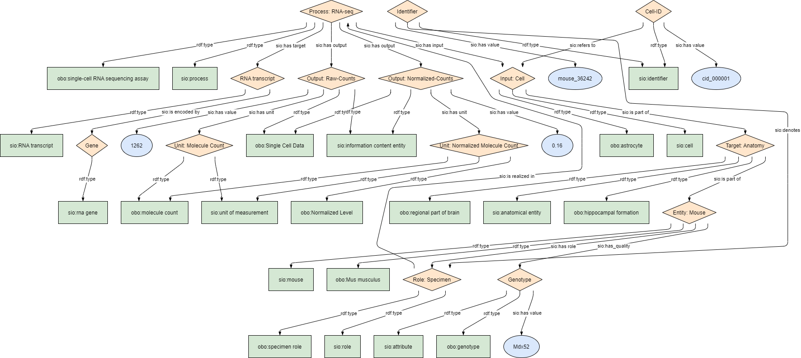

# BIND-Models
This module describes the data elements in the single-cell RNA sequencing . It specifically covers the data element in the table _DCDE Laboratory measurement_. This module is based on the EJP RD CDE semantic model module for _Disease diagnosis_ group [CDE-semantic-model/disease diagnosis](https://github.com/ejp-rd-vp/CDE-semantic-model/blob/master/docs/disease_diagnosis.md).

<p align="center">
    <a href="../images/rdf/single-cell.png" target="_blank">
        
    </a>
</p>

### Example RDF (turtle)
```ttl
@prefix : <http://w3id.org/bind/data/v1/example-rdf/> .
@prefix obo: <http://purl.obolibrary.org/obo/> .
@prefix sio: <http://semanticscience.org/resource/> .
@prefix xsd: <http://www.w3.org/2001/XMLSchema#> .
@prefix rdfs: <http://www.w3.org/2000/01/rdf-schema#> .
@prefix prov: <http://www.w3.org/ns/prov#> .


:identifier_ a sio:SIO_000115 ;
    rdfs:label "Identifier"^^xsd:string ;
    sio:SIO_000020 :role_ ;
    sio:SIO_000300 "mouse_36242"^^xsd:string .

:mouse_ a sio:SIO_000486 ;
    rdfs:label "Entity: Mouse"^^xsd:string ;
    sio:SIO_000228 :role_ ;
    sio:SIO_000008 :genotype_ ;
    sio:SIO_000008 :attribute_.
    
:role_ a obo:OBI_0000112, sio:SIO_000016 ;
    rdfs:label "Role: Specimen"^^xsd:string ;
    sio:SIO_000356 :rna_process_ .
    
:rna_process_ a obo:OBI_0002631, sio:SIO_000006 ;
    rdfs:label "Process: RNA-seq"^^xsd:string ;
    sio:SIO_000291 :expression_ ;
    sio:SIO_000229 :raw_ ;
    sio:SIO_000229 :normalized_ ;
    sio:SIO_000230 :cell_.

:cell_ a sio:SIO_010001; 
    rdfs:label "Input: Cell"^^xsd:string ;
    obo:HSO_0000243 :anatomy_.
    
:anatomy_ a obo:UBERON_0002421, obo:UBERON_0002616, sio:SIO_001262;
    rdfs:label "Target: Anatomy"^^xsd:string ;
    sio:SIO_000068 :mouse_ .

:cell_id_ a sio:SIO_000115;
    rdfs:label "Cell-ID"^^xsd:string;
    sio:SIO_000628 :cell_ ;
    sio:SIO_000300 "cid_000001"^^xsd:string .
    
:raw_ a sio:SIO_000015, obo:NCIT_C184799;
    rdfs:label "Output: Raw-Counts"^^xsd:string;
    sio:SIO_000628 :attribute_;
    sio:SIO_000221 :integer_ ;
    sio:SIO_000300 "1262"^^xsd:string .

:normalized_ a sio:SIO_000015, obo:NCIT_C184799;
    rdfs:label "Output: Normalized-Counts"^^xsd:string;
    sio:SIO_000628 :attribute_;
    sio:SIO_000221 :float_ ;
    sio:SIO_000300 "0.16"^^xsd:string .

:attribute_ a sio:SIO_000614, obo:OMIT_0016499;
    rdfs:label "Attribute: Gene Expression"^^xsd:string.
    
:float_ a sio:SIO_000074, obo:UO_0000192, obo:NCIT_C181341;
    rdfs:label "Unit: Normalized Molecule Count"^^xsd:string.

:integer_ a sio:SIO_000074, obo:UO_0000192;
    rdfs:label "Unit: Molecule Count"^^xsd:string.
    
:expression_ a sio:SIO_010450, sio:SIO_010450;
    rdfs:label "RNA transcript"^^xsd:string ;
    sio:SIO_010079 :gene_ .

:gene_ a sio:SIO_010101;
    rdfs:label "Gene"^^xsd:string .

:genotype_ a obo:SO_0001027, sio:SIO_000614 ;
    rdfs:label "Genotype"^^xsd:string ;
    sio:SIO_000300 "Mdx52"^^xsd:string .
```
### Validation artifacts
##### ShEx figure
<p align="center">
    <a href="../images/shex/single-cell.svg" target="_blank">
        
    </a>
</p>

***
##### ShEx
``` ShEx
PREFIX : <http://w3id.org/bind/data/v1/example-rdf/> 
PREFIX obo: <http://purl.obolibrary.org/obo/> 
PREFIX sio: <http://semanticscience.org/resource/> 
PREFIX xsd: <http://www.w3.org/2001/XMLSchema#> 
PREFIX rdfs: <http://www.w3.org/2000/01/rdf-schema#> 
PREFIX prov: <http://www.w3.org/ns/prov#> 

:identifierShex IRI {
    a [sio:SIO_000115] ;
    rdfs:label xsd:string? ;
    sio:SIO_000020 @:roleShex ;
    sio:SIO_000300 xsd:string 
}

:mouseShex IRI {
    a [sio:SIO_000486] ;
    rdfs:label xsd:string? ;
    sio:SIO_000228 @:roleShex;
    sio:SIO_000008 @:genotypeShex ;
    sio:SIO_000008 @:expressionShex +
}

:roleShex IRI {
    a [obo:OBI_0000112];
    a [sio:SIO_000016] ;
    rdfs:label xsd:string?;
    sio:SIO_000356 @:rna_processShex
}
    
:rna_processShex IRI {
    a [obo:OBI_0002631];
    a [sio:SIO_000006] ;
    rdfs:label xsd:string? ;
    sio:SIO_000291 @:anatomyShex;
    sio:SIO_000229 @:rawShex +;
    sio:SIO_000229 @:normalizedShex +;
    sio:SIO_000230 @:cellShex
}

:cellShex IRI {
    a [sio:SIO_010001]; 
    rdfs:label xsd:string? ;
    obo:HSO_0000243 @:anatomyShex
}
    
:anatomyShex IRI {
    a [obo:UBERON_0001950] OR [obo:UBERON_0002421];
    a [obo:UBERON_0002616];
    a [sio:SIO_001262];
    rdfs:label xsd:string?;
    sio:SIO_000008 @:expressionShex +;
    sio:SIO_000068 @:mouseShex
}

:cell_idShex IRI {
    a [sio:SIO_000115];
    rdfs:label xsd:string?;
    sio:SIO_000020 @:cellShex ;
    sio:SIO_000300 xsd:string 
}
    
:rawShex IRI {
    a [sio:SIO_000015];
    a [obo:NCIT_C184799];
    rdfs:label xsd:string?;
    sio:SIO_000628 @:expressionShex;
    sio:SIO_000221 @:integerShex;
    sio:SIO_000300 xsd:integer 
}

:normalizedShex IRI {
    a [sio:SIO_000015];
    a [obo:NCIT_C184799];
    rdfs:label xsd:string?;
    sio:SIO_000628 @:expressionShex;
    sio:SIO_000221 @:floatShex ;
    sio:SIO_000300 xsd:float 
}
    
:floatShex IRI {
    a [sio:SIO_000074];
    a [obo:UO_0000192];
    a [obo:NCIT_C181341];
    rdfs:label xsd:string?
}

:integerShex IRI {
    a [sio:SIO_000074];
    a [obo:UO_0000192];
    rdfs:label xsd:string?
}
    
:expressionShex IRI {
    a [sio:SIO_010450];
    a [sio:SIO_000614];
    rdfs:label xsd:string? ;
    sio:SIO_010079 @:geneShex
}

:geneShex IRI {
    a [sio:SIO_010101];
    rdfs:label xsd:string?
}

:genotypeShex IRI {
    a [obo:SO_0001027];
    a [sio:SIO_000614] ;
    rdfs:label xsd:string? ;
    sio:SIO_000300 xsd:string 
}
```
